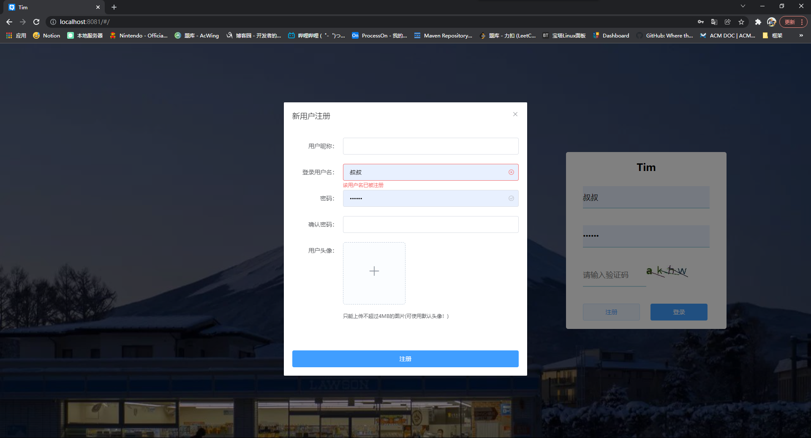
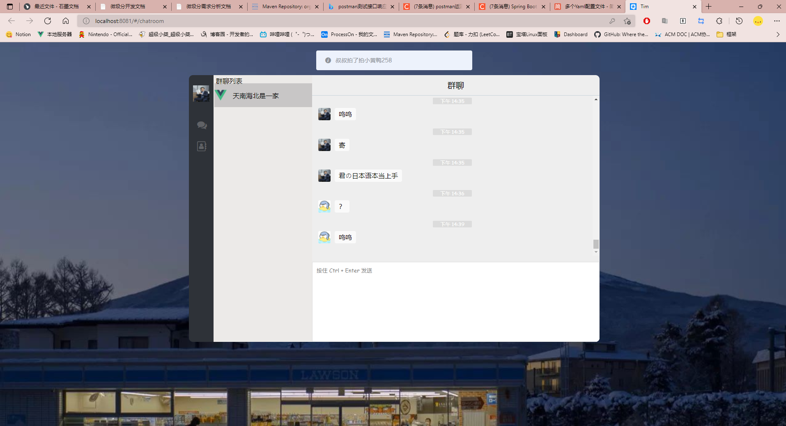
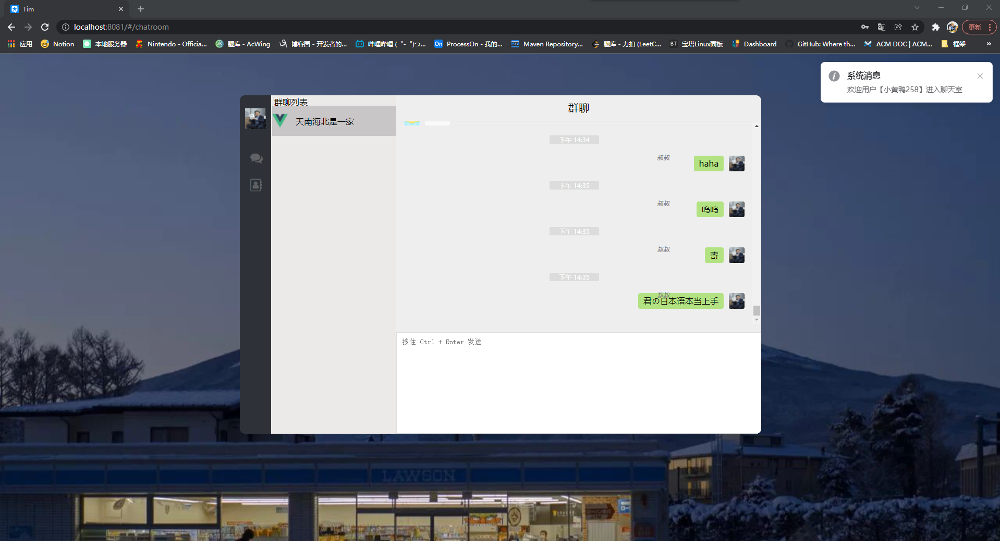
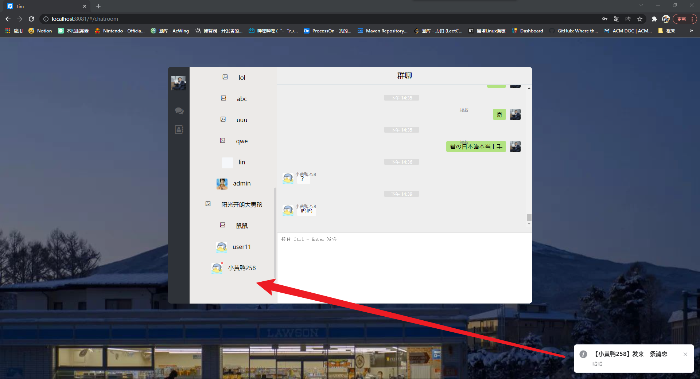

# Tim聊天室

## 简介
本项目是Web组的大作业，本项目为前端Vue项目
## 参考项目
https://github.com/genaller/genal-chat.git
https://github.com/cleverqin/node-websocket-Chatroom.git
https://github.com/JustCoding-Hai/subtlechat-vue.git
https://github.com/secreter/websocket_chat.git
https://github.com/CCZX/wechat.git
https://github.com/likaia/chat-system.git

## 截图

